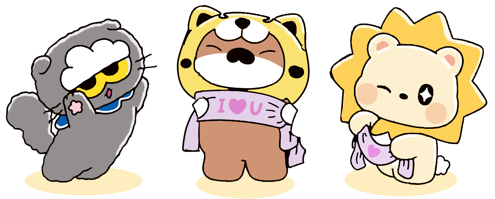

# Character tracing

A trace of the three characters in one image. Where they overlap, the hidden parts are redrawn, so each character comes out whole: no cut-off arms or faces.

## Brief

- **Style.** Match the source exactly: the same linework, colours and shading.
- **Layout.** One file per character, each one complete on its own.
- **Format.** An editable SVG for each character, plus a PNG preview.

## Files

| File | What it is |
|---|---|
| `traced/cat.svg` | The grey cat |
| `traced/bear.svg` | The bear in the yellow hood, holding the I ♥ U towel |
| `traced/lion.svg` | The cream lion with the sun mane, holding its heart towel |
| `traced/*.png` | A preview of each SVG, at twice the source size, on a transparent background |
| `traced/overview.png` | All three side by side |

Each SVG has three layers. They open as layers in Inkscape, and as groups in Illustrator and Figma.

| Layer | What's on it |
|---|---|
| `Line art` | All the black lines, as one shape |
| `Colours` | One shape per colour, named by part: `fur`, `mane`, `hood`, `towel`, `cheeks` and so on |
| `Shadow` | The yellow floor shadow, `#FEEDBE`. Hide or delete it to drop the shadow |

The highlights and the lion's cheeks have a slight blur, like the soft edges in the source.

## What was redrawn

The cat covers part of the bear, and the bear's paw and drape cover part of the lion. The covered parts are invented in the same style, so they're a best guess, not a copy.

| Character | Redrawn |
|---|---|
| Cat | Nothing was hidden. The tips of its right whiskers, which crossed the bear's face, are put back |
| Bear | The lower left and right sides of the hood, the left edge of the face, the left paw (a mirror of the right paw) and the outer edge of the left drape. The black mark on the hood's right side is finished, and a smaller matching one is added on the left. The cat's whiskers are removed from its face |
| Lion | The lower-left mane, hidden by the bear's paw and drape: one ray is finished and the next is added, following the spacing of the others. The small white gap between the towel, the mane and the right arm is left transparent, as it's background showing through |

## Folders

| Folder | What goes in it |
|---|---|
| `source/` | The original image |
| `traced/` | The traced characters |
