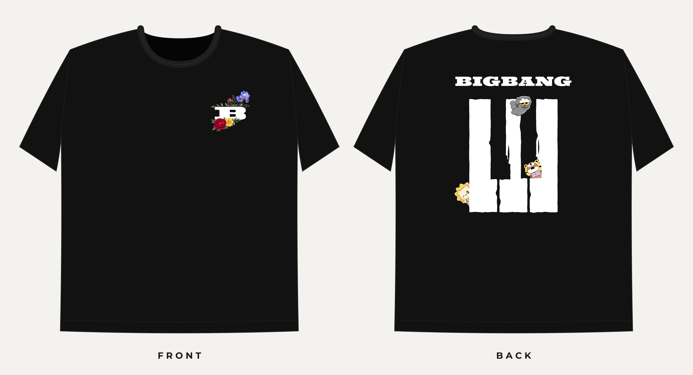
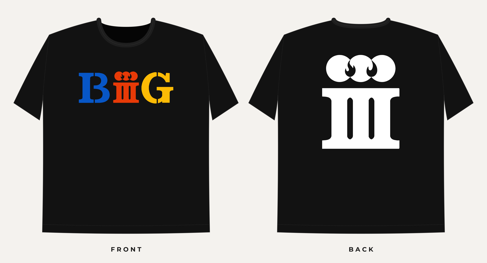

# Concert T-shirt

A new tee, separate from Floral B. It uses the same blank mockup as Floral B.

## Design

Black tee.

| Side | Artwork | Print file | Size |
|---|---|---|---|
| Front | Floral B, left chest | `print/FRONT_left-chest_100x100mm.ai` | 100 × 100 mm |
| Back | BIGBANG over the III bars, with the cat, bear and lion from `character-tracing/` | `print/BACK_270x317.4mm.ai` | 270 × 317.4 mm |

### Earlier version: BIIIG

| Side | Artwork | Colours |
|---|---|---|
| Front | BIIIG | Blue `#0756C6`, red `#E73A07`, yellow `#FDBB05` |
| Back | III, under three circles with flame cut-outs | White `#FFFFFF` |

## Folders

| Folder | What goes in it |
|---|---|
| `mockup/` | The Floral B mockup, plus the BIGBANG and BIIIG mockups built on it |
| `references/front/` | Front reference, `front-biiig.svg` (the same file as `print/front-biiig.svg`) |
| `references/back/` | Back reference, `back-iii.svg` (the same file as `print/back-iii.svg`) |
| `vector/` | Clean four-ink SVG trace of the BIIIG artwork (black, blue, yellow, red), with per-ink separations. v1 keeps the small cream BIIIG; v2 merges it into the red and black |
| `print/` | Print files. Current: `FRONT_left-chest_100x100mm.ai` and `BACK_270x317.4mm.ai`. Earlier BIIIG version: `front-biiig.svg` (blue, red, yellow) and `back-iii.svg` (white) |
