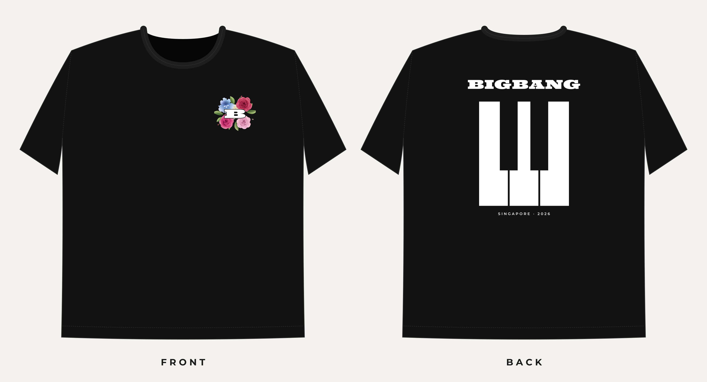

# BIGBANG SG concert tee: print files

Black tee. Front: a white slab "B" inside a ring of peonies, a rose, an iris and
leaves, worn on the left chest. Back: the BIGBANG wordmark over three piano keys,
with an optional `SINGAPORE · 2026` line underneath.

## Send these to the printer

| File | What it is |
|---|---|
| `print-files/FRONT_left-chest_100x100mm.pdf` / `.svg` | Front emblem, vector, 10 × 10 cm, full colour |
| `print-files/FRONT_left-chest_100x100mm_300dpi.png` | Same, raster at 300 dpi, transparent background |
| `print-files/FRONT_left-chest_100x100mm_4000px.png` | Hi-res raster (300 dpi up to ~33 cm wide) if they want it bigger |
| `print-files/BACK_270x326.2mm.pdf` / `.svg` | Back, vector, 27 × 32.6 cm, white ink only |
| `print-files/BACK_270x326.2mm_300dpi.png` | Same, raster at 300 dpi, transparent background |
| `mockup/spec-sheet.pdf` | Placement and size sheet (A3) for the vendor |

Notes for the vendor:

- **Print method:** DTF or DTG. The front has gradients and many colours, so it
  is not a spot-colour screen-print job as is. The back is a single colour
  (white) and can be screen-printed.
- **Background is transparent.** The black in the previews is the shirt. Do not
  print it.
- **Placement:** front emblem 7.5 cm from the centre line on the wearer's left
  chest, top edge 6.5 cm below the centre-front collar seam. Back art centred,
  10 cm below the centre-back collar seam.
- All text is converted to outlines, so no fonts are needed to open the files.
- Colours are sRGB. White = 100% white ink.

## Editing

- **Illustrator / Inkscape / Figma:** open the `.svg` (or `.pdf`). Layers are
  named: *Flowers (full colour)*, *B (white ink)*, *BIGBANG wordmark*,
  *Piano keys*, *Singapore line*. Each flower is its own group
  (`iris-blue-top-left`, `peony-crimson-top-right`, …) so it can be moved,
  recoloured or deleted. The black gap around the B is a clipping path on the
  Flowers layer.
- **Regenerate:** `pip install cairosvg fonttools shapely` then
  `python3 src/build.py`. The `SETTINGS` block at the top of `src/build.py`
  controls the front size, back width, the Singapore line text, knockout width
  and placement. Flower positions and seeds are in `front_art()`, and the
  palettes are in `src/flowers.py`.

## Fonts

- "B" and wordmark: **Ultra** (Astigmatic), Apache 2.0, stretched
  horizontally.
- Singapore line and spec sheet: **Montserrat** SemiBold, SIL OFL 1.1.

Licence files are in `fonts/`. The flowers are original vector drawings
generated by `src/flowers.py`. Nothing is traced from other artwork.

"BIGBANG" is a trademark of its owners. This design is meant for personal
fan use. Selling shirts with the name on them needs permission.
